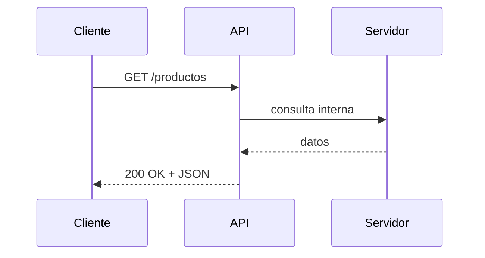
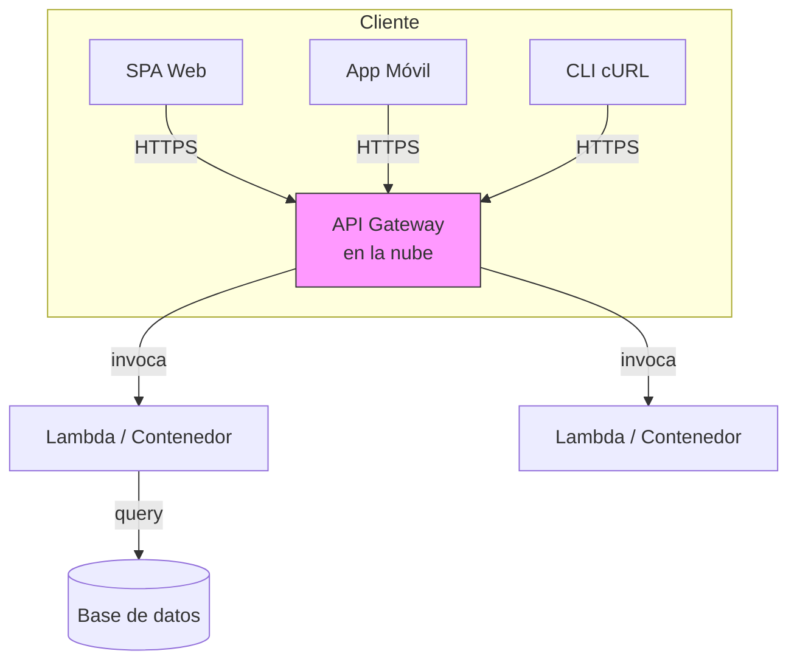

!!! abstract "Resumen"
    Una API REST es la combinación de dos ideas:  
    1. **API** (Application Programming Interface): el contrato que define **qué** puede pedir un cliente y **qué** responderá el servidor.  
    2. **REST** (Representational State Transfer): un **estilo arquitectónico** que prescribe **cómo** debe diseñarse ese contrato para que sea escalable, simple y uniforme.  

El resultado es un **servicio web sin estado** que expone recursos a través de URLs, utiliza los métodos HTTP como verbo y devuelve datos normalmente en formato JSON.

---

## 1. Concepto de API

!!! info "Definición formal"
    API (Application Programming Interface) es un **conjunto de reglas y especificaciones** que permiten que dos piezas de software se comuniquen.

### 1.1 Características esenciales
| Característica        | Descripción breve                                                                 |
|-----------------------|------------------------------------------------------------------------------------|
| **Abstracción**       | Oculta la complejidad interna del sistema expuesto.                                |
| **Contrato**          | Documenta entradas, salidas, errores y reglas de negocio.                          |
| **Reutilización**     | Permite que cualquier cliente compatible utilice la funcionalidad sin reescribirla.|
| **Versionado**        | Facilita evolucionar la funcionalidad sin romper a los clientes antiguos.          |

### 1.2 Analogía cotidiana
Imagina un **restaurante**:

*   **Cliente** ↔ Aplicación que necesita datos o funciones.  
*   **Camarero** ↔ API.  
*   **Cocina** ↔ Sistema interno (base de datos, lógica de negocio).  
El cliente pide al camarero (API) que lleve un pedido a la cocina y traiga la comida (datos). El cliente **no entra** en la cocina ni decide cómo se cocina el plato.

---

## 2. Generalidades de las API Web

!!! question "¿Qué diferencia a una API Web de cualquier otra API?"
    *   **Protocolo de transporte**: HTTP (o HTTPS).  
    *   **Formato de mensaje**: JSON, XML, form-url-encoded, etc.  
    *   **Ubicación**: Se hospeda en un servidor accesible a través de una URL pública o privada.  

### 2.1 Arquitectura cliente-servidor


### 2.2 Tipos comunes de API Web
| Tipo           | Características principales                                                  |
|----------------|------------------------------------------------------------------------------|
| **SOAP**       | XML, operaciones definidas en WSDL, estándares pesados (WS-\*).              |
| **XML-RPC / JSON-RPC** | Llamadas a procedimiento remotas sobre HTTP con XML o JSON.                 |
| **REST**       | Recursos, verbos HTTP, sin estado, cacheable, ligero (JSON).                 |
| **GraphQL**    | Consultas declarativas, una sola URL, tipos fuertes.                         |
| **gRPC**       | Protocolo binario HTTP/2, generación de stubs, ideal microservicios.         |

---

## 3. REST (Representational State Transfer)

!!! quote "Roy Fielding, 2000"
    REST es un **estilo arquitectónico**, no un estándar. Describe **seis restricciones** que, si se cumplen, producen un sistema escalable y de alto rendimiento.

### 3.1 Las 6 restricciones REST
| Restricción                    | Qué obliga a hacer                                           | Beneficio clave                  |
|--------------------------------|--------------------------------------------------------------|----------------------------------|
| **Cliente-servidor**           | Separar UI de lógica de datos.                               | Independencia de evolución.      |
| **Sin estado**                 | Cada petición contiene toda la info necesaria.               | Escalabilidad horizontal.        |
| **Cacheable**                  | Las respuestas deben indicar si se pueden cachear.           | Reduce latencia y carga.         |
| **Interfaz uniforme**          | URLs identifican recursos, verbos HTTP operan sobre ellos.   | Simplicidad y predictibilidad.   |
| **Sistema por capas**          | Puede haber proxies, gateways, CDN entre cliente y servidor. | Seguridad, balanceo, caché.      |
| **Código bajo demanda (opt.)** | El servidor puede envocar scripts ejecutables (JS, applets). | Extensibilidad del cliente.      |

### 3.2 Recursos y Representaciones
*   **Recurso**: Cualquier cosa que pueda ser nombrada (un usuario, una foto, un pedido).  
*   **Identificador**: URI única (`/usuarios/42`).  
*   **Representación**: Formato en que se envía (JSON, XML, imagen binaria).  
    Ejemplo JSON:
    ```json
    {
      "id": 42,
      "nombre": "Ana",
      "email": "ana@mail.com",
      "enlaces": {
        "self": "/usuarios/42",
        "pedidos": "/usuarios/42/pedidos"
      }
    }
    ```

---

## 4. Métodos HTTP en REST

| Método  | CRUD | Idempotente | Seguro | Uso típico                                 | Ejemplo de URL         |
|---------|------|-------------|--------|---------------------------------------------|------------------------|
| **GET** | Read | Sí          | Sí     | Obtener uno o varios recursos               | `GET /libros`          |
| **POST**| Create | No        | No     | Crear un nuevo recurso hijo                 | `POST /libros`         |
| **PUT** | Update/Replace | Sí | No   | Reemplazar completamente un recurso         | `PUT /libros/123`      |
| **PATCH**| Update/Partial | No | No  | Actualizar solo ciertos campos              | `PATCH /libros/123`    |
| **DELETE**| Delete | Sí       | No     | Eliminar un recurso                         | `DELETE /libros/123`   |

!!! tip "Consejos de diseño"
    *   No uses verbos en la URL (`/getLibros`), usa solo sustantivos.  
    *   Usa códigos de estado correctos: 201 (Created), 204 (No Content), 400, 401, 404, 409, 500.

---

## 5. Endpoints

!!! definition "Endpoint"
    Es la **combinación de un verbo HTTP y una ruta** que apunta a un recurso o colección.

### 5.1 Convenciones de nomenclatura
| Recurso        | Colección (plural) | Ejemplo colección | Ejemplo elemento |
|----------------|--------------------|-------------------|------------------|
| Usuario        | usuarios           | `GET /usuarios`   | `GET /usuarios/5`|
| Pedido         | pedidos            | `POST /pedidos`   | `PUT /pedidos/99`|
| Foto de perfil | usuarios/{id}/foto | —                 | `GET /usuarios/5/foto` |

### 5.2 Filtrado, paginado y orden
!!! example "Parámetros de consulta"
    ```
    GET /libros?autor=Garcia&pagina=3&tamanio=20&orden=titulo,asc
    ```

### 5.3 Versionado de API
*   Por URL: `/api/v1/libros`  
*   Por cabecera: `Accept: application/vnd.miapp.v1+json`

---

## 6. Formato JSON

!!! success "¿Por qué JSON?"
    *   Ligero (menos verboso que XML).  
    *   Nativo en JavaScript.  
    *   Fácil de leer y escribir para humanos y máquinas.  
    *   Soporte universal en lenguajes modernos.

### 6.1 Estructura básica
```json
{
  "id": 7,
  "titulo": "El Quijote",
  "autor": {
    "nombre": "Miguel",
    "apellido": "de Cervantes"
  },
  "tags": ["novela", "clásico", "españa"],
  "publicado": 1605,
  "disponible": true
}
```

### 6.2 Buenas prácticas
*   Usar **camelCase** para claves (`userName`).  
*   Incluir **enlaces (HATEOAS)** para facilitar la navegación.  
*   Evitar anidamientos demasiado profundos (≤ 3 niveles).  
*   Usar **fechas en ISO-8601** (`2024-07-19T15:30:00Z`).

---

## 7. Servicio en la Nube

!!! cloud "¿Qué significa «servicio en la nube»?"
    Es un **entorno de ejecución remoto** (IaaS, PaaS o SaaS) donde se despliega la API REST, ofreciendo:

*   Escalabilidad automática (auto-scaling).  
*   Alta disponibilidad (99.9% SLA).  
*   Gestión de certificados SSL/TLS.  
*   Balanceo de carga global.  
*   Integración con CI/CD.

### 7.1 Proveedores habituales
| Proveedor | Servicio de alojamiento de API | Características destacadas |
|-----------|-------------------------------|----------------------------|
| **AWS**   | API Gateway + Lambda          | Infraestructura serverless, pay-per-use. |
| **Azure** | API Management + Functions    | Integración con Active Directory. |
| **GCP**   | Cloud Endpoints + Cloud Run   | Soporte nativo de gRPC y REST. |

### 7.2 Ejemplo de despliegue serverless con AWS
```bash
sam deploy --guided \
  --template-file api-template.yml \
  --stack-name mi-api-rest \
  --capabilities CAPABILITY_IAM
```
Esto genera:
*   Una función Lambda con tu código.  
*   Un API Gateway que mapea URLs a la Lambda.  
*   Logs en CloudWatch y monitoreo en CloudWatch Alarms.

---

## 8. Clientes REST

!!! user "¿Qué es un cliente REST?"
    Cualquier programa que **consume** la API siguiendo el contrato REST.

### 8.1 Tipos de clientes
| Tipo                 | Ejemplos                                | Consideraciones |
|----------------------|-----------------------------------------|-----------------|
| **Navegador**        | SPA Angular, React, Vue                 | CORS, tokens JWT. |
| **Móvil**            | Apps Android (Retrofit), iOS (Alamofire)| Gestión de red offline, caché. |
| **Backend**          | Microservicio A llamando a microservicio B | Circuit breakers, retries. |
| **CLI / Scripts**    | cURL, Postman, PowerShell               | Útiles para pruebas y automatización. |

### 8.2 Ejemplo de cliente con `curl`
```bash
# Obtener token
curl -X POST https://api.miapp.com/auth \
  -H "Content-Type: application/json" \
  -d '{"usuario":"ana","clave":"secreto"}'

# Usar token
curl -H "Authorization: Bearer $TOKEN" \
     https://api.miapp.com/usuarios/42
```

### 8.3 SDKs generados
Muchos proveedores publican **SDKs oficiales** que abstraen las peticiones HTTP:

=== "JavaScript (Axios)"
    ```js
    import axios from 'axios';
    const api = axios.create({baseURL: 'https://api.miapp.com/v1'});
    const {data} = await api.get('/libros');
    ```

=== "Python (requests)"
    ```python
    import requests
    r = requests.get('https://api.miapp.com/v1/libros',
                     headers={'Authorization': f'Bearer {token}'})
    libros = r.json()
    ```

---

## 9. Resumen visual



---

## 10. Recursos adicionales

*   [Documentación oficial de REST – Roy Fielding](https://www.ics.uci.edu/~fielding/pubs/dissertation/rest_arch_style.htm)  
*   [OpenAPI 3.x](https://spec.openapis.org/oas/v3.1.0) – Estandariza la descripción de tu API REST.  
*   [Postman Learning Center](https://learning.postman.com) – Pruebas y generación de documentación.  
*   [Google Cloud API Design Guide](https://cloud.google.com/apis/design) – Buenas prácticas de Google.
